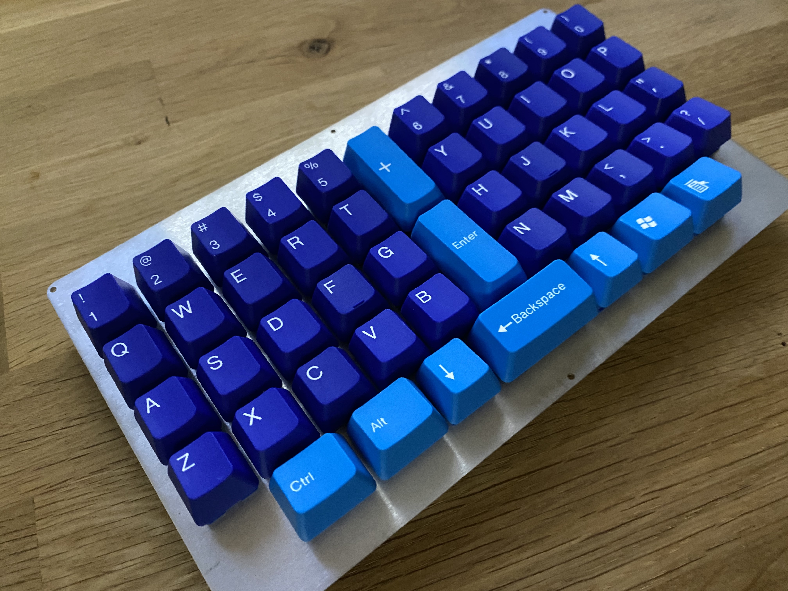

# Cheddar Jack

This keyboard was designed specifically to expand the Little Foot keyboard to 11u with a center column, allowing for convenient placement of escape, enter, or backspace.

These files are for a prototype keyboard and offer no warranty or guarantee of function.

# I haven't had the time to build firmware for this one yet, so only the Gerber files are available at this time

# Also note that the 6.5u spacebar configuration requires plate mount stabilizers (PCB mounts were not included because teh 6.5u spacebar is mostly for Alps/AEK support)

A zip file of the gerbers has been provided that you can upload to your PCB maker of choice (PCBway, JLCPCB, etc.) and order.

Thie keyboard requires the following components to build:
* Pro Micro or Pro Micro Elite C controller
* 1N4148 diodes
* Pro Micro header or socket
* switches
* stabilizers

These boards have not been ported to QMK proper - Hex files and JSON files from https://kbfirmware.com are provided so that you can start using the keyboards right away.

If you are unfamiliar with building Pro Micro based boards refer to the many build guides for Keebio products, etc. 

Rule of thumb - first Diodes, then Headers/socket for the Pro Micro, then install stabilzers if using PCB mount, then switches, and **the Pro Micro last.

A link to KLE has been provided if you want to create your own plate files.

# KLE
http://www.keyboard-layout-editor.com/#/gists/cb5413eccba76cb8e9623352675857e8
