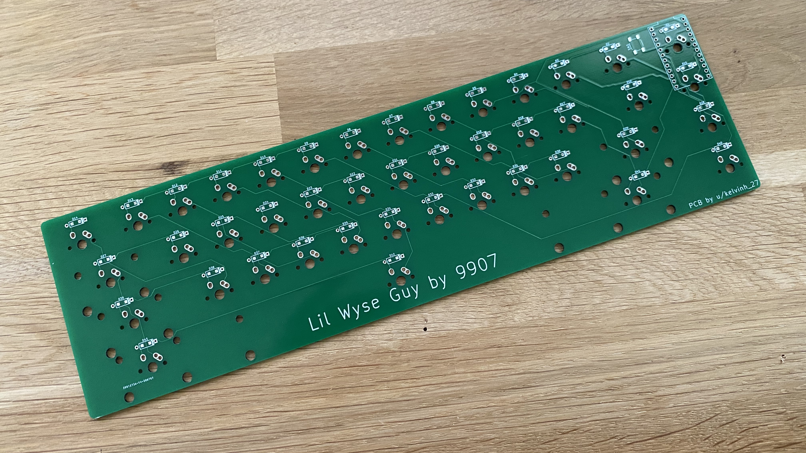
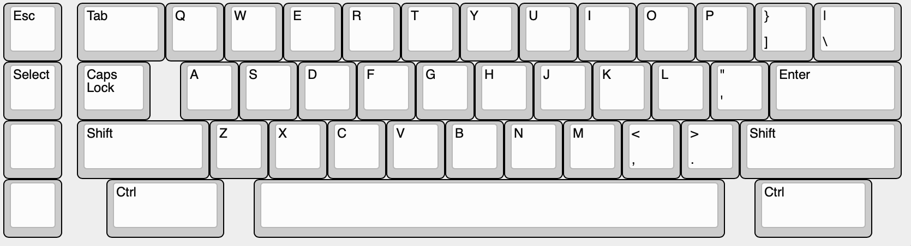

# Lil Wyse Guy

This keyboard was designed specifically to use Wyse keycaps (specifically their layout with an 8u spacebar). It is MX compatible so you can substitute a 7u spacebar, but will need to create a plate with cutouts for 7U plate mount stabilzers.

These files are for a prototype keyboard and offer no warranty or guarantee of function.

A zip file of the gerbers has been provided that you can upload to your PCB maker of choice (PCBway, JLCPCB, etc.) and order.

Thie keyboard requires the following components to build:
* Pro Micro or Pro Micro Elite C controller
* 1N4148 diodes
* Pro Micro header or socket
* switches
* stabilizers

These boards have not been ported to QMK proper - Hex files and JSON files from https://kbfirmware.com are provided so that you can start using the keyboards right away.

If you are unfamiliar with building Pro Micro based boards refer to the many build guides for Keebio products, etc. 

Rule of thumb - first Diodes, then Headers/socket for the Pro Micro, then install stabilzers if using PCB mount, then switches, and **the Pro Micro last.

A link to KLE has been provided if you want to create your own plate files.

# KLE
http://www.keyboard-layout-editor.com/#/gists/0c8a0f106a7f56a417a3ea27870c8133

**Please note that the Wyse keycaps have unusual steppings on the stepped keys, the Caps Lock, and the two Control keys. Because of this there is an empty space where the step should be.**

You can create a plate using this layout, but not a top cover.

