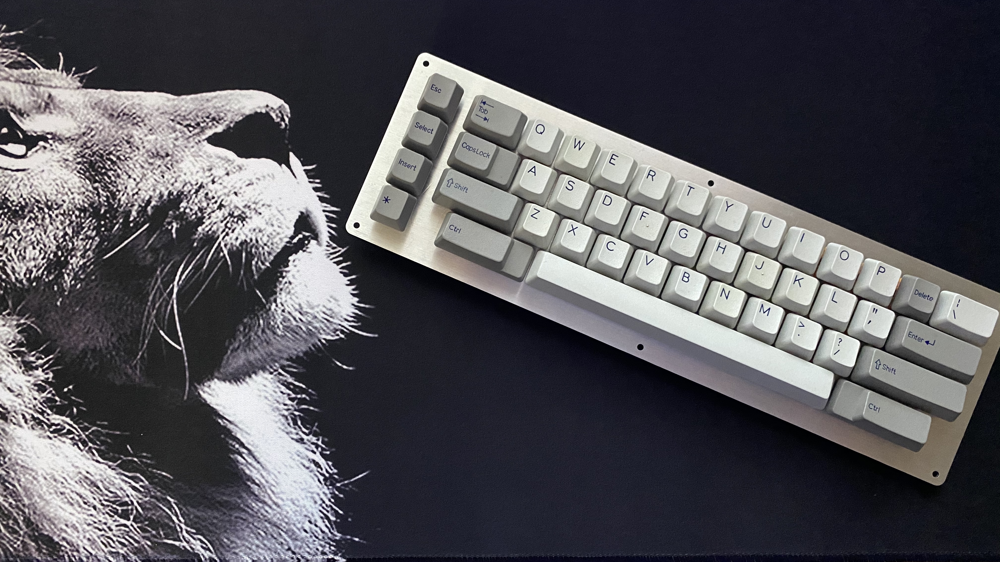
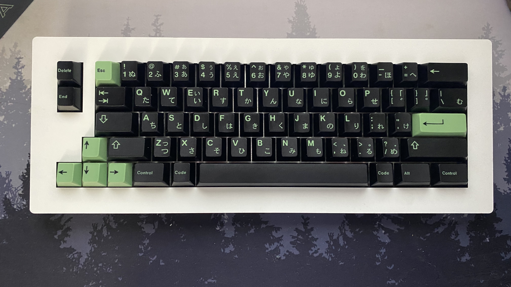
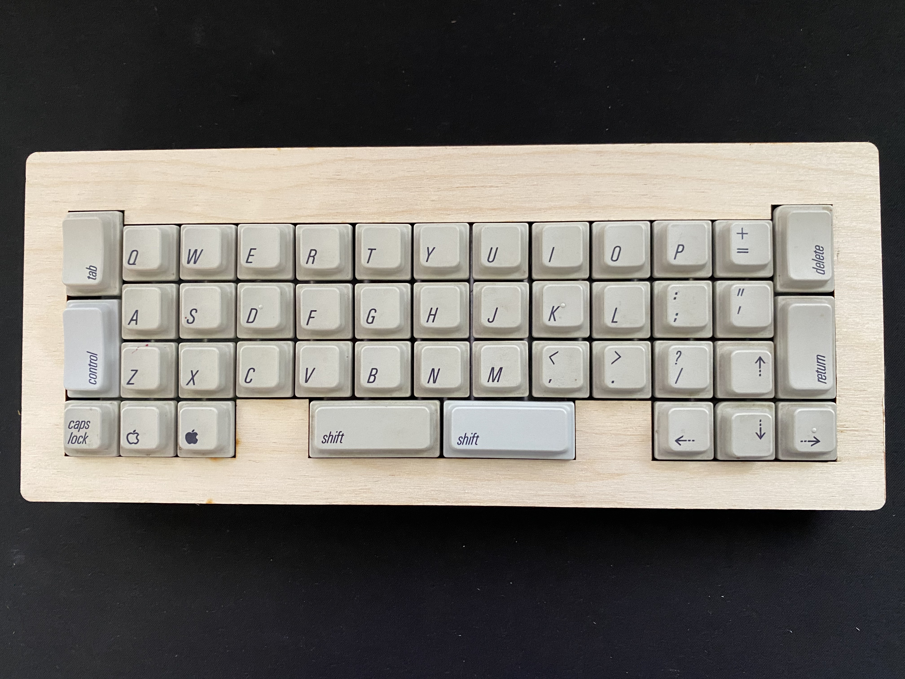
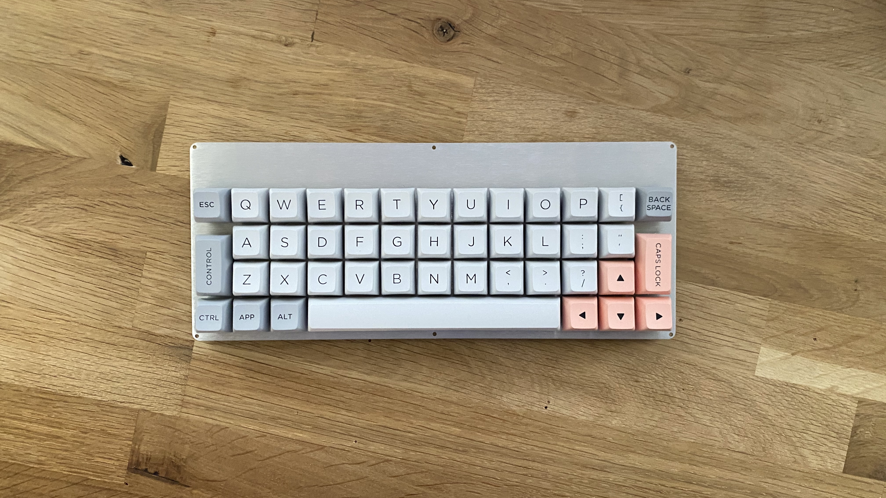

# Fun Board Prototypes

I love odd ducks. Have fun with these odd duck keyboard PCBs, designed for fun not for profit.

These files are for prototype keyboards and offer no warranty or guarantee of function.

All of these keyboards require a Pro Micro or Pro Micro Elite C controller, diodes, switches and stabilizers to function.

These boards have not been ported to QMK proper - Hex files and JSON files from Kbfirmwarebuilder are provided so that you can start using the keyboards right away.

