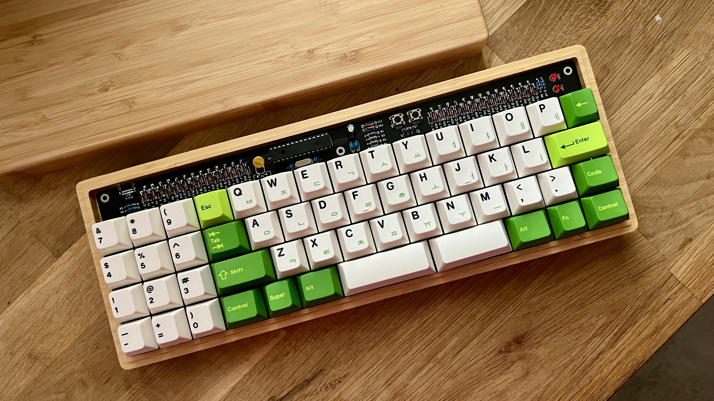
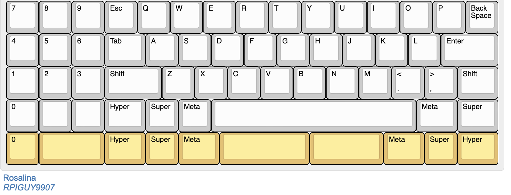

# Rosalina

40% with Num Pad that fits in a 60% tray mount case! 

Supported layouts:

Note that only a few mounting holes are available in the PCB due to key placement. In fact, the newer tray cases with fewer mount points are a not a good choice for this PCB.

PCB and Firmware files are not guaranteed to work, although I have built and tested them.

ALPS plate is completely untested. MX Plate was tested, but is not guaranteed to work.

Uses the same BOM as Lumberjack by Peej and in fact this is based off his Rosaline project. The PCB is labeled correctly for you to place the components.

The BOM is located here:

https://github.com/peej/lumberjack-keyboard/blob/master/BOM.md
