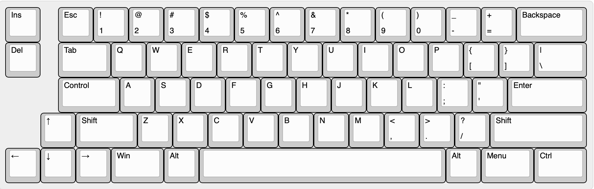

# Southpaw66

These files are for a prototype keyboard and offer no warranty or guarantee of function.

A zip file of the gerbers has been provided that you can upload to your PCB maker of choice (PCBway, JLCPCB, etc.) and order.

All of these keyboards require a Pro Micro or Pro Micro Elite C controller, diodes, Pro Micro header or socket, switches and stabilizers to function.

These boards have not been ported to QMK proper - Hex files and JSON files from Kbfirmwarebuilder are provided so that you can start using the keyboards right away.

If you are unfamiliar with building Pro Micro based boards refer to the many build guides for Keebio products, etc. 

Rule of thumb - first Diodes, then Headers/socket for the Pro Micro, then install stabilzers if using PCB mount, then switches, and **the Pro Micro last.

A link to KLE has been provided if you want to create your own plate files.

# KLE
http://www.keyboard-layout-editor.com/#/gists/c6da65aba82a19e511225238815665c1

